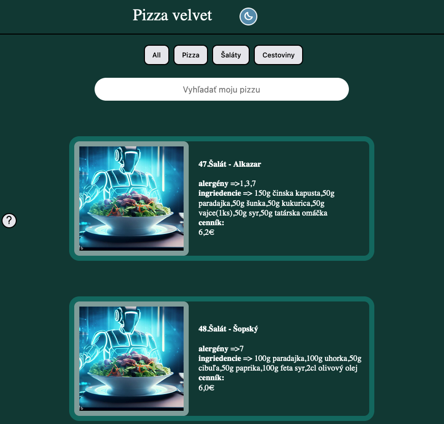

 
# ENGLISH

## Info-food

## Hello everyone
I created a project for my portfolio, the task of which is to inform about prices and allergens in our nearby company,
I worked on the project alone and here and there I helped myself with google or my cheat sheets.
Here I will show how I do the day and night mode,
Next, I'll show how I search using an input element,
my own design,
and filtering using buttons elements.

# SLOVAKIA

## JEDÁLNY LÍSTOK

### Zdravím všetkých

Vytvoril som projekt pre moje portfólio, ktorého  má  za úlohou informovať o cenách a alergénoch v našom blízkom podniku,
Na projekte som pracoval sám a sem-tam som si pomohol googlením alebo mojimi cheat sheetmi.
Tu ukážem, ako robím denný a nočný režim,
Ďalej ukážem, ako vyhľadávam pomocou input prvku,
môj vlastný dizajn a filtrovanie pomocou button tlačidiel.
